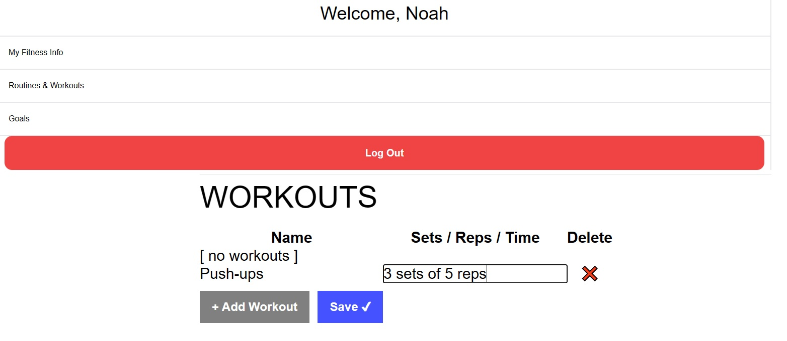

# SweatMate 💧

# Vision 📝
SweatMate is a fun and intuitive fitness app that provides customized workout plans, tracks your progress, and helps maintain good posture to avoid injury. With easy-to-follow visuals and instructions, the app caters to all levels of fitness enthusiasts. You can create your own workout plans, track progress, and adjust workouts accordingly. The app's unique feature is the ability to maintain good posture with visual cues and reminders. This feature is particularly helpful for beginners. SweatMate is the ultimate fitness companion to take your workouts to the next level!

Visit SweatMate and get started today! [https://sweatmate.herokuapp.com/](https://sweatmate.herokuapp.com/)

# Authors ✏️
- Kole Dallam
- Gabe Faber
- Noah Nielsen
- Paul Dutile

# Built using 🚧
- HTML
- CSS / Tailwind
- Javascript
- Handlebars
- mySQL / Sequelize

# Trials we experienced 💢
- Wrapping our heads around the models for our app was a little difficult for a bit, but ultimately we mostly figured things out.
- We did have to scratch some bells and whistles from our orginal app just to get the MVP out in time.

# Continuing Develpoment
- Add calendar for better planning of workouts and routines.
- Implement Routines to hold lists of workouts
- Implement database of workouts the user can select from
- Finish Goals feature
- Finish Progress Tracker feature

# License 📄
- This project is Licensed under the MIT License.
